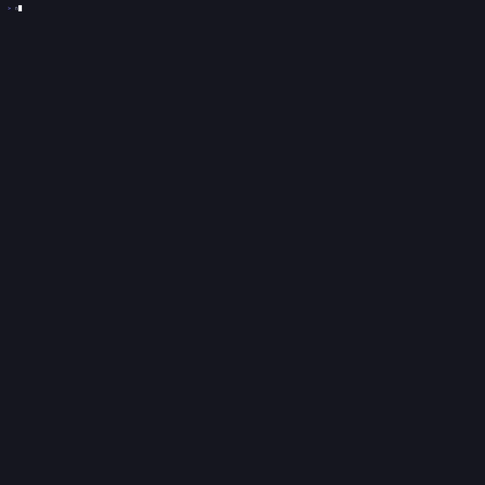
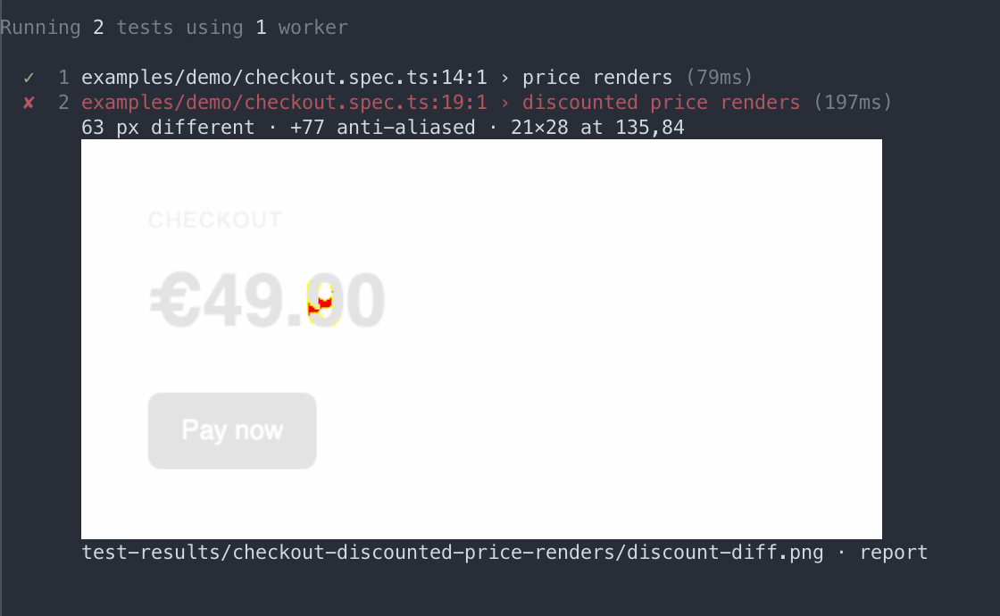

# ocelli

[](https://www.npmjs.com/package/ocelli)
[](https://github.com/wazum/playwright-ocelli/actions/workflows/ci.yml)
[](#requirements)
[](#requirements)
[](#requirements)
[](LICENSE)

A Playwright reporter that prints screenshot diffs in your terminal, next to the
failure that produced them.



When `toHaveScreenshot()` fails you ask one question: real regression, or
rendering noise? Answering it normally costs a context switch — find the path,
open the HTML report. ocelli answers it at the moment of failure, so you only
open the report when it is worth opening.

It replaces the `list` reporter: everything `list` prints, plus the diff image, a
one-line numeric summary, and a link into the report. Keeping `list` configured
next to it prints every test twice, and ocelli says so at the top of the run.

## What it prints

Under each failing test, indented to line up with Playwright's own output:

```
  ✘  2 checkout.spec.ts:19:1 › discounted price renders (192ms)
       63 px different · +77 anti-aliased · 21×28 at 135,84
       test-results/checkout/discount-diff.png · report
```

The diff image is drawn between those two lines, as in the recording above. Both
destinations are hyperlinks: the path opens the image, `report` opens that test
in the HTML report.

The numbers sit above the image on purpose. Playwright paints real differences
red and anti-aliasing yellow, and ocelli counts them apart — so the summary stays
reliable even when downscaling hides a small diff.

Frames of different sizes are named as such first, as in `size differs ·
expected 480×240, got 480×300 · 136599 px different`. Playwright pads the
shorter frame before comparing, so the count that follows is largely counting
that padding.

At the end of a run:

```
2 snapshots differ · accept with: npx playwright test --update-snapshots
```

A snapshot that differed and then passed on a retry is reported without that
advice — `1 snapshot differed, then passed on retry` — because accepting it
would write the unstable rendering into the baseline.

## Install

```
npm install -D ocelli
```

```js
// playwright.config.ts
export default defineConfig({
  reporter: 'ocelli',
})
```

With options:

```js
reporter: [['ocelli', { maxImages: 3, maxRows: 20 }]]
```

## Real images: `mode: 'kitty'`

By default you get block art, because it survives SSH, CI logs and every
terminal. **`auto` never selects kitty**, and runs no capability query at all —
terminals answer "supported" and then paint nothing, and silently invisible
output is the worst way a reporter can fail. So the real thing is opt-in:

```js
reporter: [['ocelli', { mode: 'kitty' }]]
```



That needs a terminal implementing the kitty graphics protocol. `OCELLI_MODE=kitty`
switches a single run without touching the config.

When `mode` is left at `auto` and the environment names a terminal that draws
them — kitty, ghostty, wezterm — a run that printed block art ends by saying so
once. Configuring `blocks` yourself turns that off: a mode you chose is a
decision, not something to nudge. The reverse is reported too, so `mode: 'kitty'`
in a terminal that never announced itself says as much instead of printing
nothing visible.

## Options

| option | default | meaning |
|---|---|---|
| `mode` | `'auto'` | `'auto'` \| `'blocks'` \| `'kitty'` \| `'off'` |
| `maxImages` | `5` | images per run, then summaries only |
| `maxRows` | `16` | height budget per image |
| `cellAspect` | `2.1` | cell height ÷ width |

`auto` turns the image off when stdout is not a TTY or `CI` is set. An explicit
`blocks` or `kitty` overrides that — but colours must be on for any image to be
drawn, so a pipe also needs `FORCE_COLOR=1` or `PLAYWRIGHT_FORCE_TTY=100x40`.
Without colours, or outside a terminal, the summary and both destinations are
printed as plain text instead of hyperlinks.

`OCELLI_MODE` overrides `mode` for one run. Options are validated at startup: a
`maxRows` of `0` or `"tall"`, or a misspelled option name, is a configuration
error rather than a silently strange picture or a setting that does nothing.

`Options` and `Mode` are exported for config authors who want the names checked:

```ts
import type { Options } from 'ocelli'

const ocelli: Options = { mode: 'kitty', maxRows: 20 }
```

## Known limitations

- **kitty hands downscaling to the terminal.** On a full-page screenshot a small
  diff can vanish from the picture. The summary line always carries the numbers,
  which is why it sits above the image.
- **tmux swallows the image** unless `allow-passthrough` is on.
- **Retries print one image each**, matching how `list` prints retry lines.
- **Legacy Windows conhost** may not render `▀`.

## Requirements

Node 20.19+, `@playwright/test` `>=1.62.1 <2` as a peer dependency. Zero runtime
dependencies. Both floors are exercised in CI on every push, not just declared.

### It reaches into Playwright's private modules

Playwright does not export the `list` reporter, a PNG decoder or an East Asian
width table, and ocelli extends and uses all three. So it imports
`playwright/lib/runner` and `playwright-core/lib/utilsBundle` — internal paths,
covered by no compatibility promise.

So a Playwright upgrade can break ocelli within a minor version. Two things
guard against meeting that in a test run: ocelli checks the surface on startup
and names the part that moved, and a weekly canary run tests against whatever
Playwright published last.

Nothing is patched or monkey-patched — ocelli subclasses the reporter and calls
it, with no effect on how your tests run.

## Licence

MIT © Wolfgang Klinger
